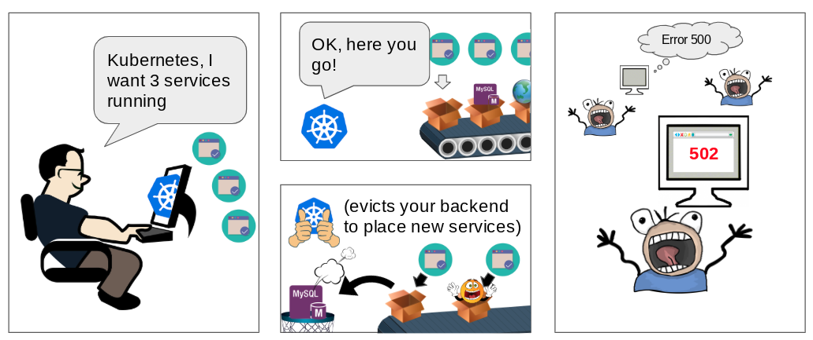
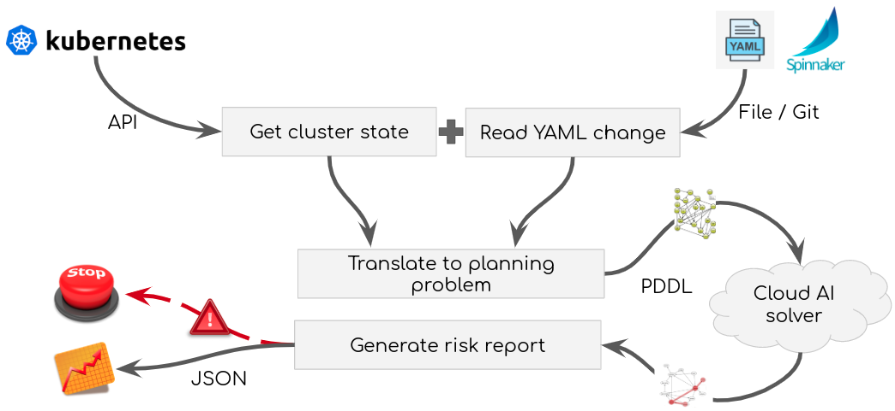

# kubectl-val

[](https://opensource.org/licenses/Apache-2.0)

# Overview



`kubectl-val` is a formal validator for whole kubernetes clusters' configurations using [AI planning](https://en.wikipedia.org/wiki/Automated_planning_and_scheduling). It is written in pure `Python` and translated to [PDDL](https://en.wikipedia.org/wiki/Planning_Domain_Definition_Language) using [poodle](https://github.com/criticalhop/poodle).

`kubectl-val` implements a simplified kubernetes model using an object-oriented state machine and searches for any scenario that may lead to a 'failure'. Failures are currently defined as `Service` having no associated running pods. Other definitions are also possible and are currently work in progress. 

## Architecture

To search for a failure scenario, kubectl-val builds a model representation of current cluster state that it reads from files created by `kubectl get -o=yaml`. The constructed model is sent to PDDL planner and the resulting solution is then interpreted as a failure scenario and sent back to console as YAML-encoded scenario steps.

Scenario output can later be used by the pipeline operator to aid with decision making - e.g. whether stop the deployment, log the event to the dashboard, etc.

Kubectl also calculates the probability of the scenario by multiplying the probability associated with every step.



`kubectl-val` depends on a configured PDDL AI-planning solver running as http service and talking to poodle. You can grab one from [criticalhop-solver](https://github.com/criticalhop/criticalhop-solver) repository. By default `kubectl-val` uses a hosted [CriticalHop](https://www.criticalhop.com/) demo SaaS solver.

# Quick Start

## Installation

    $ pip install kubectl-val

`kubectl-val` comes as a simple [kubectl plugin](https://kubernetes.io/docs/tasks/extend-kubectl/kubectl-plugins/) so a working `kubectl` is a requirement if you want to access real cluster. If you do not have `kubectl` you can use it just as standalone shell command `kubectl-val` instead of `kubectl val ...`

## Usage

### Checking if creating a resource won't break anything

To try it against sample "broken" kubernetes configurations, use `-d` option to supply a folder with a collection of Kubernetes resources' stored from `kubectl get <...> -o=yaml > <...>.yaml`, and try to create a new resource with `-f`, e.g.:

    $ cd examples/daemonset-eviction
    $ kubectl val -d cluster-dump/ -f daemonset_create.yaml
    
### Checking a Kubernetes configuration for correctness

Invoking `kubectl val` without `-f` will run a check of current configuration and (hopefully) find no issues, as the configuration is already running. 

    $ kubectl val -d cluster-dump/

### Checking live cluster

Before checking the cluster you should first "dump" all of current resources into a "cluster dump" folder:

```shell
mkdir my-cluster-dump
cd my-cluster-dump
kubectl get nodes -o=yaml > nodes.yaml
kubectl get pods -o=yaml > pods.yaml
kubectl get services -o=yaml > services.yaml
kubectl get priority -o=yaml > priority.yaml
...
```

After you have the dump folder, you can continue with a check described above.

# Build from source

```shell
git clone https://github.com/criticalhop/kubectl-val
cd kubectl-val
pip install .
```

# Vision

The goal for the project is to create an intent-driven, self-healing Kubernetes configuraiton system that would abstract the cluster manager from error-prone manual tweaking.

# Project Status

`kubectl-val` is a developer preview and currently supports a subset of resource/limits validation and partial label match validation.

We invite you to follow [@criticalhop](https://twitter.com/criticalhop) on [twitter](https://twitter.com/criticalhop) and if you are interested to know more please subscribe to our email updates at [criticalhop.com/demo](https://www.criticalhop.com/demo)
